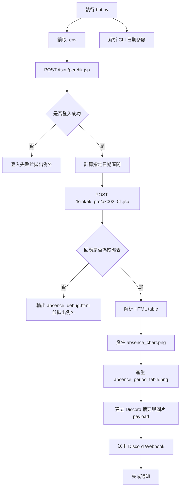

# easy-tpcu

`easy-tpcu` 是一個用 Python 撰寫的自動化工具，用於登入臺北城市科技大學校務系統，依指定日期區間查詢缺曠 / 請假紀錄，解析回傳的 HTML 表格，並透過 Discord Webhook 發送即時通知。

這個工具的目標很單純：直接打 API 查詢、整理成清楚的摘要與表格，再送到 Discord。這版不再依賴 SQLite 歷史資料庫，比對新舊紀錄也不再是核心。

## 功能

- 自動登入臺北城市科技大學校務系統
- 可自行指定查詢單日或日期區間
- 解析校務系統回傳的 HTML 表格
- 直接產生缺曠 / 請假統計圖表
- 產生現代化、簡潔的節次表格
- 每次查詢都將摘要與圖片發送到 Discord Webhook
- 將查詢結果輸出為 `absence_debug.html` 便於除錯

## 流程圖



## 技術

- Python
- `requests`
- `BeautifulSoup`
- `python-dotenv`
- `matplotlib`

## 專案結構

```text
.
├── bot.py
├── outputs/
│   ├── charts/
│   └── debug/
├── README.md
├── requirements.txt
└── tpcu_absence_notifier/
    ├── client.py
    ├── config.py
    ├── discord_notifier.py
    ├── models.py
    ├── parser.py
    └── reporting.py
```

- `bot.py`：程式入口，負責串接整體流程
- `outputs/`：所有自動產生的輸出檔
- `tpcu_absence_notifier/config.py`：讀取 `.env` 與設定
- `tpcu_absence_notifier/client.py`：登入與缺曠查詢 request
- `tpcu_absence_notifier/parser.py`：HTML 表格解析
- `tpcu_absence_notifier/reporting.py`：圖表、節次表格與摘要格式化邏輯
- `tpcu_absence_notifier/discord_notifier.py`：Discord Webhook 通知與圖片附件組裝

## 安裝方式

1. 複製專案：

```bash
git clone https://github.com/alaner652/easy-tpcu
cd easy-tpcu
```

2. 建立並啟用虛擬環境：

```bash
python3 -m venv venv
source venv/bin/activate
```

3. 安裝相依套件：

```bash
pip install -r requirements.txt
```

4. 複製環境變數範例檔：

```bash
cp .env.example .env
```

5. 編輯 `.env`：

```env
TPCU_UID=你的學號
TPCU_PWD=你的密碼
DISCORD_WEBHOOK=你的 Discord Webhook URL
TPCU_YMS=114,2
TPCU_OUTPUT_DIR=outputs
```

### 環境變數說明

- `TPCU_UID`：校務系統帳號
- `TPCU_PWD`：校務系統密碼
- `DISCORD_WEBHOOK`：Discord Webhook URL
- `TPCU_YMS`：學年期參數，預設為 `114,2`
- `TPCU_OUTPUT_DIR`：輸出根目錄，預設為 `outputs`

## 使用方法

直接執行，預設會查詢「今天往前 30 天」：

```bash
python bot.py
```

查詢單日：

```bash
python bot.py --date 2026-03-19
```

查詢日期區間：

```bash
python bot.py --start-date 2026-03-01 --end-date 2026-03-19
```

只給一邊也可以，會自動視為單日：

```bash
python bot.py --start-date 2026-03-19
python bot.py --end-date 2026-03-19
```

若查詢成功，程式會：

1. 登入校務系統
2. 依指定日期區間查詢缺曠 / 請假資料
3. 解析 HTML 表格
4. 產生 `outputs/charts/absence_chart.png` 圖表
5. 產生 `outputs/charts/absence_period_table.png` 節次表格
6. 將摘要與兩張圖片送到 Discord Webhook
7. 額外輸出 `outputs/debug/absence_debug.html` 供檢查原始回應內容

這版每次查詢都會通知 Discord。即使沒有缺曠紀錄，也會送出「本次區間無資料」的摘要，方便確認排程是否正常。

## 專案背景

這個專案是把原本要手動登入校務系統、設定日期、打開明細表的流程自動化，讓缺曠查詢變成一個可重複執行的腳本。

執行後會直接查詢指定日期區間、整理成圖表與節次表格，並透過 Discord Webhook 發送結果，方便自己平常快速確認狀態。

## 未來計畫

- 支援排程執行，例如搭配 cron 定時檢查
- 補上更完整的錯誤處理與重試機制
- 補上學期累積統計、每週趨勢、假別分布與節次熱圖
- 補上測試與更多 CLI 參數，例如學期或輸出路徑覆寫

## 注意事項

- 本工具依賴校務系統目前的頁面流程與欄位名稱，若校方修改系統，程式可能需要同步調整
- 請妥善保管 `.env` 中的帳號、密碼與 Webhook
- 請僅在合法且經授權的情境下進行測試與使用

免責聲明： 本專案僅供學術研究與個人自動化工具開發練習使用。
請勿用於非法用途，開發者不承擔任何因不當使用導致的法律責任。
